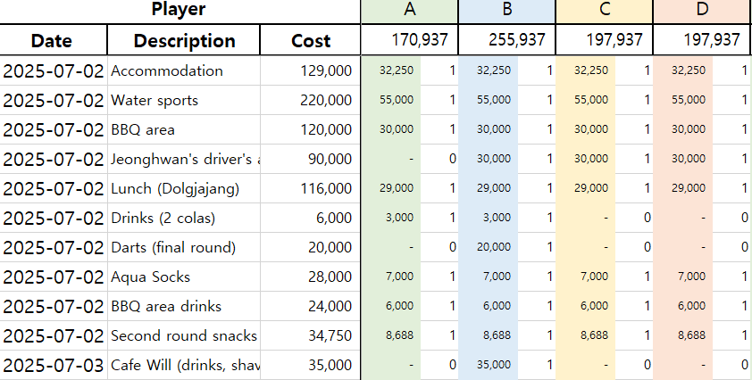

## 📊 Example Usage

The following example shows how the settlement tool works:

### 📌 Scenario Breakdown

On **2025-07-02**, the group spent money on various activities such as accommodation, water sports, lunch, and more.

For each cost item:
- Participants (A, B, C, D) input **non-negative weights** based on how much they were involved.
- The sheet calculates how much each person owes based on their weight **proportionally**.

#### ✅ Example: Water Sports  
- Total Cost: **220,000 KRW**
- Participation Weights:
  - A: 1  
  - B: 1  
  - C: 1  
  - D: 1  
- Each pays: 220,000 / 4 = **55,000 KRW**

#### ✅ Example: Jeonghwan's Driver's License  
- Total Cost: **90,000 KRW**
- Only **B** participated (weight = 1); others have 0
- So B pays the full amount: **90,000 KRW**

#### ✅ Example: Cafe Will (on 2025-07-03)  
- Total Cost: **35,000 KRW**
- Only **B** participated (weight = 1); others = 0
- B pays **35,000 KRW**, others = 0

---

### 🔄 Cumulative Total (Top Row)

The top row shows each participant’s **running total** after all rows are calculated.

In the example:
- **A** owes: `170,937 KRW`  
- **B** owes: `255,937 KRW`  
- **C** owes: `197,937 KRW`  
- **D** owes: `197,937 KRW`

---

### ⚙️ Key Rules Recap

- You can use **any non-negative real number** as a weight (e.g., `0.5`, `2`, `0`)
- If weight = 0 → that person doesn’t share the cost
- Final share = `Total Cost × (individual weight / total weight)`
